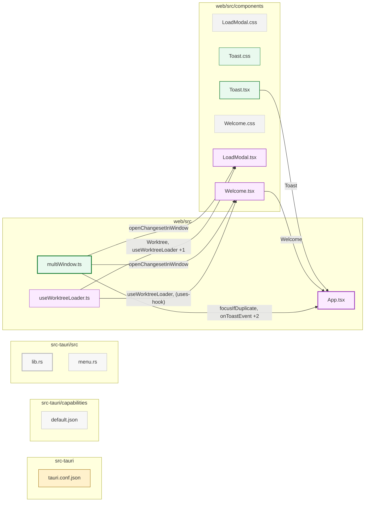

# Multi-window

Shippable is single-window today, so reviewers can't hold two changesets at once without losing their place. This plan adds OS-level multi-window to the Tauri shell: each window is an independent reviewer on its own changeset, sharing the sidecar, localStorage, and prompt library. The only cross-window coordination is duplicate detection — opening a changeset that's already loaded focuses the existing window instead of spawning another.

## Goal

What this enables:

- `⌘N` (or **File → New Window**) opens a fresh reviewer window on the picker.
- Every recent on the Welcome screen has an "open in new window" affordance next to it, so jumping back into a recent review can go to a new window rather than replacing the current one.
- Trying to open a changeset that is already open in another window is blocked: the existing window is focused instead. No "open anyway" escape hatch — having the same review in two windows produces too many ways for state to diverge (progress, comments, marks) and we don't want users to discover that the hard way.
- Closing the last window quits the app and tears down the sidecar.

What it explicitly does *not* try to do:

- Live state sync between windows. Different changesets per window only — duplicates are blocked at open time, so there is no shared-state case to engineer for.
- Window restoration across launches. Single-window-fresh on launch, with the existing "pick up where you left off" recents strip doing the rest.
- Tabs, side-by-side panes, or any in-window arrangement. The OS window manager is the surface.
- A browser-mode equivalent. The browser already supports multiple tabs/windows of `localhost:5173`; this plan is Tauri-only.

## What already works (so the plan is smaller than it looks)

Three things happen to be in good shape:

- **The sidecar is already shared.** One sidecar process per app instance, launched at startup, stashed in `SidecarRuntime` in `src-tauri/src/lib.rs`. Every window discovers its port via the existing `get_sidecar_port()` Tauri command. Adding more windows costs nothing on the server side.
- **localStorage is shared per-origin.** All windows in one Tauri app see the same keys. Review progress (`shippable:review:v1` in `web/src/persist.ts`) and recents (`shippable:recents:v1` in `web/src/recents.ts`) are already keyed by changeset id, so per-changeset progress persists across windows automatically. No schema changes.
- **Changeset identity is already stable.** `ChangeSet.id` for worktree ranges encodes `(worktreePath, fromRef, toRef, isDirty)` deterministically (`web/src/worktreeChangeset.ts:119-126`). Two windows showing the same source produce the same id, which is exactly what duplicate detection needs.

The real work is window plumbing, a small Rust-side registry, and one new modal.

## The slices

**(a) Multi-window foundation.** A Tauri command `open_new_window()` that spawns a `WebviewWindowBuilder` pointed at the same URL as the main window (`tauri://localhost`, via `WebviewUrl::App("index.html".into())`). Window labels generated as `window-{counter}` and kept in Rust state. New windows cascade 30px down-and-right from the focused window so they don't stack pixel-perfect. A minimal macOS app menu — just `File → New Window` (`⌘N`), `File → Close Window` (`⌘W`), and whatever defaults Tauri gives — wired up to call the command. `⌘W` on the last window closes it and quits the app. *Done when:* `⌘N` opens a new window on the picker, closing all windows quits the app, both windows talk to the same sidecar. *Blocking next:* nothing — slices (b) and (c) are independent.

**(b) "Open in new window" on recents.** The recents strip in `web/src/components/Welcome.tsx` gets a per-row ↗ icon button. Clicking it calls `open_new_window({ changesetId })`; the new window reads the param at boot and hydrates straight into the review via the existing `loadFromRecent()` path, skipping the picker. `⌘N` from the menu still lands on the empty picker. From inside an active review the same affordance lives on each row of the existing `LoadModal` — no new topbar surface — so the entry point is the same place users already go to switch reviews. *Done when:* you can open any recent in a new window from either the Welcome screen or the `LoadModal`.

**(c) Duplicate detection (hard block).** Rust keeps a registry: `HashMap<WindowLabel, Option<ChangesetId>>`. The web app reports its currently-loaded changeset via a new `set_window_changeset(id)` command on load and on every changeset switch; clearing back to the picker reports `None`. Before opening a changeset (from menu, recents, or any other entry point), the web app calls `list_window_changesets()`. If another window already has the same id, the open is refused and the existing window is focused via `set_focus()` on the matching window label. A brief in-app toast confirms what just happened ("Already open — focused that window"), so the user isn't left wondering why nothing happened. There is no "open anyway" option. *Done when:* opening a duplicate focuses the existing window and shows the toast, opening a non-duplicate works normally, and the registry stays consistent when windows close.

## Architecture sketch

```
┌─ Window A (review) ──────┐  ┌─ Window B (picker) ──────┐  ┌─ Window C (review) ──────┐
│  loaded: pr-42           │  │  loaded: none            │  │  loaded: pr-43           │
│  reports id to Rust ─────┼──┼──> registry              │  │  reports id to Rust ─────┤
│                          │  │                          │  │                          │
│  fetch /api/* ───────────┼──┼──> shared sidecar <──────┼──┼── fetch /api/*           │
│  localStorage read/write │  │  localStorage read/write │  │  localStorage read/write │
│         │                │  │         │                │  │         │                │
└─────────┼────────────────┘  └─────────┼────────────────┘  └─────────┼────────────────┘
          │                             │                             │
          └─────────── one origin: tauri://localhost ──────────────────┘
                                        │
                                        ▼
                       ┌─ Rust shell (src-tauri/) ──────────┐
                       │  SidecarRuntime: port, child       │
                       │  WindowRegistry: label → cset id   │
                       │  commands:                         │
                       │    open_new_window(opts)           │
                       │    set_window_changeset(id)        │
                       │    list_window_changesets()        │
                       │    focus_window(label)             │
                       └────────────────────────────────────┘
```

The crucial property: **same origin for every window.** New windows are spawned via `WebviewUrl::App("index.html")`, identical to the main window. Anything else (blob URLs, data URLs, sandboxed contexts) makes the browser send `Origin: null`, which `server/src/index.ts:1313-1356` rejects intentionally — a CSRF mitigation we should not undermine to make multi-window work.

## Things to watch out for

- **The opaque-origin trap.** Covered above. Documented at `server/src/index.ts:1313-1356`. Anyone reaching for a Blob URL or `data:` document to launch a window will hit this and assume the CORS check is broken; it isn't.
- **Wry/WKWebView native dialog limits.** `window.confirm`, `window.alert`, and blob-URL `<a target="_blank">` downloads silently fail. The duplicate-detection toast must be an in-app component, not `window.alert`. (`AGENTS.md` → "Tauri/Wry constraints".)
- **Last-window-close quitting.** macOS Tauri default behavior, but verify the current `tauri.conf.json` doesn't override it. The sidecar child must be reaped on app exit; the existing `SidecarRuntime` shutdown path should already handle it — confirm before shipping slice (a).
- **Window label collisions.** Use a monotonically-incrementing counter held in Rust state, never reuse labels after a window closes (closed-then-reopened windows get fresh labels). Important because the registry keys off them.
- **Stale registry entries.** When a window closes, Rust must drop its entry. Subscribe to the `WindowEvent::CloseRequested` / `Destroyed` events on each spawned window and remove the label from the registry there.
- **Same-window changeset switches.** When a user switches changesets within one window (back to picker, then load another), the window must re-report to Rust. Hook into the same path that updates `recents` so the two stay aligned.

## Review notes

The toast surface (`web/src/components/Toast.tsx`, `web/src/components/Toast.css`) was only loosely reviewed during the initial pass — the rest of the multi-window plumbing got more scrutiny. Worth a closer look on the next touch (a11y on the live region, dismiss-on-click, stacking behavior if we ever emit two toasts close together).

## Open questions

- **Menu beyond the minimum.** This plan ships the smallest menu that makes `⌘N` and `⌘W` real. A full app menu (Edit, View, Window, Help) is its own design problem; not in scope here.
- **Capability flag.** Browser-mode dev doesn't have windows, only tabs. The "New Window" affordance should be hidden when running outside Tauri. Detect via the same flag that gates other Tauri-only features.

## File map


